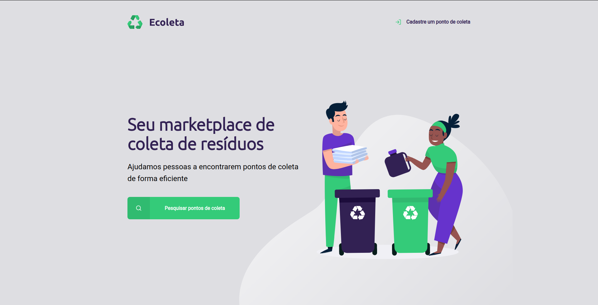
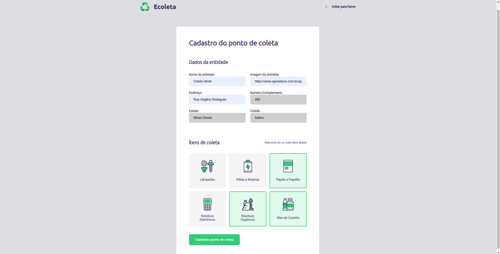
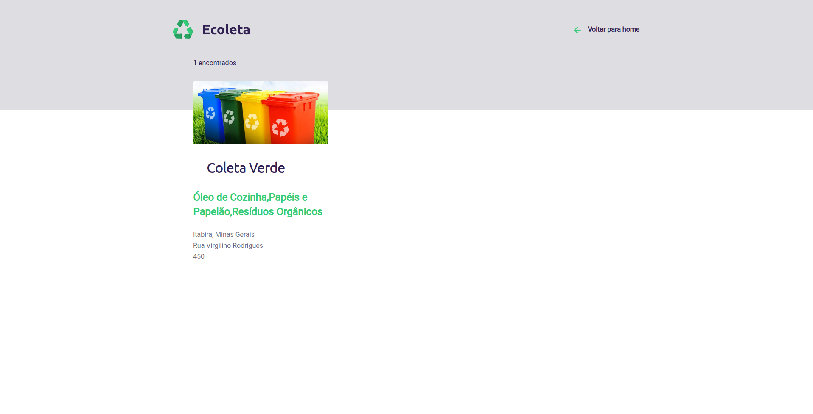

# Ecoleta

### Descrição

Um site para cadastrar pontos de coleta de lixo. Auxiliando as pessoas a encontrarem um local mais próximo de modo fácil e rápido.

Desenvolvido na Next Level Week 1º edição, feita pela Rocketseat

### Tecnologias utilizadas
- HTML 
- CSS
- Javascript
- Nunjunks
- Nodemon
- NodeJS
- SQLite3
- Express

## Telas da aplicação

### Home Page

### Cadastro de um ponto de coleta

### Pesquisar um ponto de coleta

### Pontos de coleta

